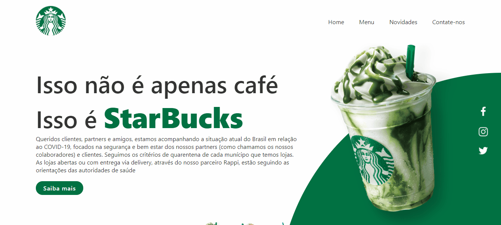

<h1 align="center">
  
</h1>

<h1 align="center">Front-end web application 📟 👨‍💻</h1>

<h2 align="center">This web page was made with the purpose of develop my web application's skills   in this project I was based on building a page for Starbucks☕ with some interactive animations for the user </h2> 

# **Main Page - Layout** 💻

  

 

## 🚀 Used Technologies:

 

## **
Starting a new jurney on my way to become a developer🐱‍🏍
**

### 
 <h2 align="center"> This application was entire made by Miguel Cruz😎 </h2> 

